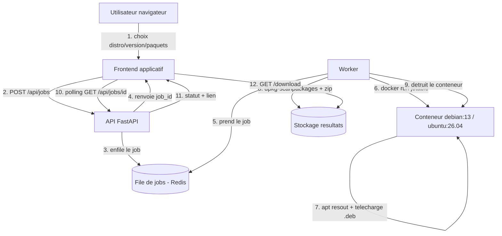

# Architecture du moteur backend — deb-downloader

> Document de conception. Copyright © 2026 Remilulz91 — Tous droits réservés.
> Cible MVP : **Debian 13** et **Ubuntu 26.04** (amd64). Versions plus anciennes ensuite.

---

## 1. Principe directeur

La règle d'or du projet : **ne jamais réinventer la résolution de dépendances.**
C'est `apt` qui sait, mieux que quiconque, quels paquets sont nécessaires pour
une distribution et une version données. On se contente donc de **lancer un
conteneur Docker de la distribution exacte demandée**, d'y interroger `apt`, de
télécharger les `.deb`, d'en faire un mini-dépôt local, puis de **détruire le
conteneur**. Le résultat correspond donc exactement à ce qu'obtiendrait
l'utilisateur sur sa vraie machine.

Conséquence directe : le moteur **doit** tourner sur un hôte Linux avec Docker.
Il est totalement découplé du site vitrine (statique) déjà réalisé.

---

## 2. Vue d'ensemble des composants

Le système se décompose en quatre rôles.

Le **frontend applicatif** est l'interface de sélection (distribution, version,
paquets). C'est une page web légère qui n'appelle qu'une API HTTP. Elle peut
être servie en statique, comme la vitrine.

L'**API** (Python / FastAPI) reçoit les demandes, valide les entrées, crée un
« job » et expose son état et son résultat. Elle ne fait jamais le travail lourd
elle-même : elle le délègue.

Le **worker** consomme les jobs d'une file d'attente. Pour chaque job, il
orchestre un conteneur Docker jetable, y exécute la récupération `apt`, assemble
le `.zip`, puis nettoie.

Le **conteneur cible jetable** est une instance de `debian:13` ou `ubuntu:26.04`
créée à la volée, sans réseau privilégié, détruite après usage. C'est la seule
partie qui exécute du code lié à la distribution.



---

## 3. Flux détaillé d'un job

L'utilisateur choisit `Ubuntu 26.04` et saisit `nginx`. Le frontend envoie un
`POST /api/jobs`. L'API valide (distribution connue, noms de paquets bien
formés, quotas), crée un identifiant de job, l'enfile et répond immédiatement
avec ce `job_id` — l'utilisateur n'attend pas.

Un worker prend le job. Il démarre un conteneur jetable de l'image
correspondante. À l'intérieur, il rafraîchit les index (`apt-get update`) puis
calcule la liste complète des URLs à télécharger :

```bash
apt-get install --reinstall --print-uris -y --no-install-recommends nginx \
  | grep -oE "https?://[^']+\.deb"
```

`--print-uris` demande à `apt` de **résoudre tout l'arbre de dépendances** et de
lister les URLs des `.deb`, sans rien installer. Le worker télécharge chaque
`.deb` dans un dossier de travail (option robuste : `apt-get install
--download-only -o Dir::Cache::archives=/work/debs ...`, puis on copie le cache).

Une fois les `.deb` récupérés, le worker génère l'index du dépôt local :

```bash
cd /work
dpkg-scanpackages debs /dev/null | gzip -9c > debs/Packages.gz
```

Il ajoute un petit `INSTALL.txt` expliquant comment utiliser le dépôt hors-ligne,
puis compresse l'ensemble en `.zip`. Le conteneur est détruit (`docker rm -f`).
Le worker dépose le `.zip` dans le stockage des résultats et marque le job
`done`. Le frontend, qui interrogeait `GET /api/jobs/{id}`, voit le statut passer
à `done` et propose un bouton **Télécharger** pointant vers `GET
/api/jobs/{id}/download` — un simple clic, le `.zip` arrive chez l'utilisateur.

---

## 4. Contenu du `.zip` livré

Conformément à l'objectif air-gapped, le `.zip` n'est pas un simple tas de
fichiers : c'est un **dépôt local prêt à l'emploi**.

```
nginx_ubuntu-26.04_amd64.zip
└── debs/
    ├── nginx_*.deb
    ├── libpcre3_*.deb
    ├── ... (toutes les dépendances)
    └── Packages.gz          ← index généré par dpkg-scanpackages
└── INSTALL.txt              ← instructions hors-ligne
```

`INSTALL.txt` indique les deux usages possibles côté utilisateur : soit
l'installation directe (`sudo dpkg -i debs/*.deb` puis `sudo apt-get install -f`),
soit l'ajout comme dépôt local (`deb [trusted=yes] file:/chemin/debs ./` dans
`sources.list`, puis `apt-get update && apt-get install nginx`). La seconde
méthode gère proprement l'ordre des dépendances.

---

## 5. File de jobs & exécution asynchrone

La récupération peut durer de quelques secondes à plusieurs minutes (gros arbres
de dépendances, téléchargements >300 Mo). On ne bloque donc jamais la requête
HTTP. On utilise une **file d'attente** :

- **MVP** : Redis + RQ (Redis Queue), simple à mettre en place, suffisant pour un
  worker. L'API enfile, le worker dépile.
- **Évolution** : plusieurs workers, priorités, reprise sur erreur.

Le polling côté frontend (toutes les 2 s) est suffisant pour le MVP ; on pourra
passer à du Server-Sent Events / WebSocket plus tard pour le live.

---

## 6. Sécurité & isolation (point critique)

Exécuter des conteneurs à la demande est une **surface d'attaque** : il faut
l'isoler sérieusement, même si les seules commandes lancées sont des `apt`.

Les conteneurs cibles sont **jetables et non privilégiés** (`--rm`, pas de
`--privileged`, pas de montage du socket Docker à l'intérieur). On limite leurs
ressources (`--memory`, `--cpus`, `--pids-limit`) et on impose un **timeout** au
worker (kill du conteneur au-delà de N minutes). Le réseau du conteneur est
restreint au strict nécessaire (accès aux miroirs apt uniquement, idéalement via
un proxy/cache apt comme `apt-cacher-ng`, ce qui accélère aussi les jobs
répétés). Les entrées utilisateur (noms de paquets) sont **strictement
validées** par une liste blanche de caractères (`^[a-z0-9][a-z0-9+._-]*$`) et
jamais interpolées dans un shell sans contrôle — on passe les arguments en
tableau, pas en chaîne. Enfin l'API applique des **quotas** (voir §7).

Le worker, lui, parle au démon Docker : il doit tourner sur un hôte dédié ou une
VM isolée, pas sur une machine sensible.

---

## 7. Limites & quotas (anti-abus, gestion disque)

Pour éviter qu'un job ne sature le disque ou monopolise la machine, on fixe des
plafonds configurables : nombre maximum de paquets par job (ex. 20), taille
totale maximale du résultat (ex. 1 Go, le job échoue proprement au-delà),
timeout par job (ex. 10 min), et nombre de jobs simultanés. Les résultats
(`.zip`) sont **éphémères** : purge automatique après expiration (ex. 24 h) par
une tâche planifiée, et nettoyage immédiat des dossiers de travail après chaque
job. Un cache de miroir apt (`apt-cacher-ng`) réduit fortement la bande passante
et le temps pour les paquets souvent demandés.

---

## 8. Stack technique retenue

Le backend est en **Python 3.12+ / FastAPI** (Uvicorn) : c'est l'écosystème le
mieux outillé pour Debian/apt et l'orchestration Docker. La file est **Redis +
RQ**. L'orchestration Docker se fait via le **SDK Python `docker`** (ou,
plus simple et plus robuste pour le MVP, des appels `subprocess` à la CLI
`docker run`). Les images cibles sont les officielles `debian:13` et
`ubuntu:26.04`. Tout est packagé en **`docker-compose`** : un service `api`, un
service `worker`, un service `redis`, et optionnellement `apt-cacher-ng`. Le
déploiement sur la VM Linux se résume alors à `docker compose up -d`.

---

## 9. API HTTP (esquisse)

`POST /api/jobs` reçoit `{ "distro": "ubuntu", "release": "26.04", "arch":
"amd64", "packages": ["nginx"] }` et renvoie `{ "job_id": "...", "status":
"queued" }`.

`GET /api/jobs/{job_id}` renvoie l'état : `queued`, `running`, `done` (avec
`download_url`, `size`, `package_count`) ou `error` (avec `message`).

`GET /api/jobs/{job_id}/download` renvoie le `.zip` (`Content-Disposition:
attachment`), ce qui déclenche le téléchargement direct dans le navigateur.

`GET /api/distributions` renvoie la liste des couples distribution/version
supportés, pour peupler dynamiquement les menus du frontend.

---

## 10. Arborescence backend proposée

```
deb-downloader-backend/
├── docker-compose.yml
├── api/
│   ├── main.py            # routes FastAPI
│   ├── models.py          # schémas Pydantic (validation des entrées)
│   ├── queue.py           # enfilage RQ
│   └── config.py          # quotas, distros supportées
├── worker/
│   ├── worker.py          # boucle RQ
│   ├── fetch.py           # orchestration docker run + apt
│   └── build_repo.py      # dpkg-scanpackages + zip + INSTALL.txt
├── shared/
│   └── distros.py         # mapping distro/version -> image Docker
└── tests/
    └── test_fetch.py
```

---

## 11. Périmètre du MVP & suite

Le MVP valide le flux de bout en bout sur **une distribution, une version, un
paquet** : `Ubuntu 26.04` + `nginx`, amd64, sortie `.zip`. Une fois ce chemin
fonctionnel, on étend à **Debian 13**, puis au **multi-paquets**, puis aux
**versions plus anciennes** des deux distributions, et enfin à **arm64**.

Étapes concrètes dans l'ordre :

1. Script `fetch.py` autonome (hors API) : `docker run` Ubuntu 26.04 → récupère
   `nginx` + deps → produit un `.zip`. C'est le cœur ; on le valide en ligne de
   commande d'abord.
2. `build_repo.py` : génération `Packages.gz` + `INSTALL.txt` + zip.
3. API FastAPI minimale (`POST /api/jobs`, `GET /api/jobs/{id}`, `/download`) avec
   exécution synchrone d'abord, puis bascule sur Redis/RQ.
4. Frontend applicatif de sélection (séparé de la vitrine) branché sur l'API.
5. Durcissement : quotas, timeouts, isolation réseau, purge, apt-cacher-ng.
6. Extension Debian 13, multi-paquets, anciennes versions, arm64.

---

## 12. Rappel déploiement

La **vitrine** (ce dépôt) reste 100 % statique, déployable par glisser-déposer.
Le **moteur** ci-dessus se déploie séparément sur une VM Linux via
`docker compose up -d`. Les deux ne partagent que l'API HTTP : le frontend
applicatif pointe vers l'URL publique du backend.
