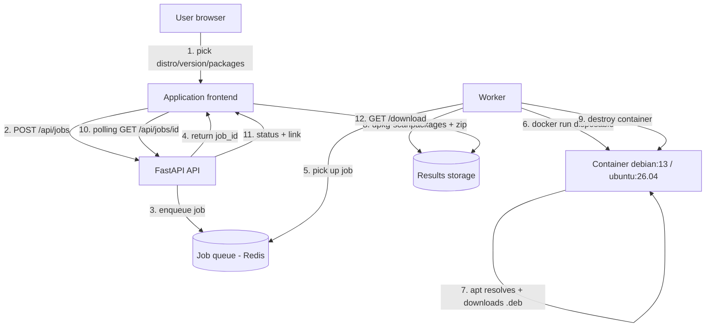

# Backend engine architecture — deb-downloader

> Design document. Copyright © 2026 Remilulz91 — All rights reserved.
> MVP target: **Debian 13** and **Ubuntu 26.04** (amd64). Older versions later.

---

## 1. Guiding principle

The golden rule of the project: **never reinvent dependency resolution.** `apt`
knows, better than anyone, which packages are required for a given distribution
and version. So we simply **spin up a Docker container of the exact requested
distribution**, query `apt` inside it, download the `.deb` files, build a small
local repository, then **destroy the container**. The result therefore matches
exactly what the user would get on their real machine.

A direct consequence: the engine **must** run on a Linux host with Docker. It is
fully decoupled from the (static) website already built.

---

## 2. Component overview

The system breaks down into four roles.

The **application frontend** is the selection UI (distribution, version,
packages). It is a lightweight web page that only calls an HTTP API. It can be
served statically, like the landing page.

The **API** (Python / FastAPI) receives requests, validates input, creates a
"job", and exposes its state and result. It never does the heavy lifting
itself: it delegates.

The **worker** consumes jobs from a queue. For each job it orchestrates a
disposable Docker container, runs the `apt` fetch inside it, assembles the
`.zip`, then cleans up.

The **disposable target container** is an instance of `debian:13` or
`ubuntu:26.04` created on the fly, without privileged networking, destroyed
after use. It is the only part that runs distribution-specific code.



---

## 3. Detailed job flow

The user picks `Ubuntu 26.04` and enters `nginx`. The frontend sends a
`POST /api/jobs`. The API validates (known distribution, well-formed package
names, quotas), creates a job id, enqueues it, and immediately responds with
that `job_id` — the user does not wait.

A worker picks up the job. It starts a disposable container of the matching
image. Inside, it refreshes the indexes (`apt-get update`) and then computes the
full list of URLs to download:

```bash
apt-get install --reinstall --print-uris -y --no-install-recommends nginx \
  | grep -oE "https?://[^']+\.deb"
```

`--print-uris` asks `apt` to **resolve the whole dependency tree** and list the
`.deb` URLs without installing anything. The worker downloads each `.deb` into a
working folder (robust option: `apt-get install --download-only -o
Dir::Cache::archives=/work/debs ...`, then copy the cache).

Once the `.deb` files are fetched, the worker generates the local repository
index:

```bash
cd /work
dpkg-scanpackages debs /dev/null | gzip -9c > debs/Packages.gz
```

It adds a short `INSTALL.txt` explaining how to use the offline repository, then
zips everything. The container is destroyed (`docker rm -f`). The worker drops
the `.zip` into results storage and marks the job `done`. The frontend, which
was polling `GET /api/jobs/{id}`, sees the status flip to `done` and offers a
**Download** button pointing at `GET /api/jobs/{id}/download` — one click and the
`.zip` reaches the user.

---

## 4. Contents of the delivered `.zip`

In line with the air-gapped goal, the `.zip` is not just a pile of files: it is
a **ready-to-use local repository**.

```
nginx_ubuntu-26.04_amd64.zip
└── debs/
    ├── nginx_*.deb
    ├── libpcre3_*.deb
    ├── ... (all dependencies)
    └── Packages.gz          ← index generated by dpkg-scanpackages
└── INSTALL.txt              ← offline instructions
```

`INSTALL.txt` describes both ways to use it on the target machine: either a
direct install (`sudo dpkg -i debs/*.deb` then `sudo apt-get install -f`), or
adding it as a local repository (`deb [trusted=yes] file:/path/debs ./` in
`sources.list`, then `apt-get update && apt-get install nginx`). The second
method handles dependency ordering cleanly.

---

## 5. Job queue & asynchronous execution

A fetch can take from a few seconds to several minutes (large dependency trees,
downloads >300 MB). We never block the HTTP request, so we use a **queue**:

- **MVP**: Redis + RQ (Redis Queue), simple to set up, enough for one worker.
  The API enqueues, the worker dequeues.
- **Later**: multiple workers, priorities, retry on failure.

Frontend polling (every 2 s) is enough for the MVP; we can move to
Server-Sent Events / WebSocket later for live updates.

---

## 6. Security & isolation (critical)

Running containers on demand is an **attack surface** and must be seriously
isolated, even though the only commands run are `apt`.

Target containers are **disposable and unprivileged** (`--rm`, no
`--privileged`, no Docker socket mounted inside). We cap their resources
(`--memory`, `--cpus`, `--pids-limit`) and enforce a **timeout** on the worker
(kill the container past N minutes). The container network is restricted to the
strict minimum (access to apt mirrors only, ideally through an apt proxy/cache
like `apt-cacher-ng`, which also speeds up repeated jobs). User input (package
names) is **strictly validated** against an allowlist of characters
(`^[a-z0-9][a-z0-9+._-]*$`) and never interpolated into a shell without control
— arguments are passed as an array, not a string. Finally the API enforces
**quotas** (see §7).

The worker, which talks to the Docker daemon, must run on a dedicated host or an
isolated VM, never on a sensitive machine.

---

## 7. Limits & quotas (anti-abuse, disk management)

To prevent a job from filling the disk or hogging the machine, we set
configurable caps: maximum number of packages per job (e.g. 20), maximum total
result size (e.g. 1 GB, the job fails cleanly beyond that), per-job timeout
(e.g. 10 min), and number of concurrent jobs. Results (`.zip`) are
**ephemeral**: auto-purged after expiry (e.g. 24 h) by a scheduled task, and
working folders cleaned immediately after each job. An apt mirror cache
(`apt-cacher-ng`) greatly reduces bandwidth and time for frequently requested
packages.

---

## 8. Chosen technical stack

The backend is **Python 3.12+ / FastAPI** (Uvicorn): the best-tooled ecosystem
for Debian/apt and Docker orchestration. The queue is **Redis + RQ**. Docker
orchestration uses the **Python `docker` SDK** (or, simpler and more robust for
the MVP, `subprocess` calls to the `docker run` CLI). Target images are the
official `debian:13` and `ubuntu:26.04`. Everything is packaged with
**`docker-compose`**: an `api` service, a `worker` service, a `redis` service,
and optionally `apt-cacher-ng`. Deployment on the Linux VM then boils down to
`docker compose up -d`.

---

## 9. HTTP API (sketch)

`POST /api/jobs` receives `{ "distro": "ubuntu", "release": "26.04", "arch":
"amd64", "packages": ["nginx"] }` and returns `{ "job_id": "...", "status":
"queued" }`.

`GET /api/jobs/{job_id}` returns the state: `queued`, `running`, `done` (with
`download_url`, `size`, `package_count`) or `error` (with `message`).

`GET /api/jobs/{job_id}/download` returns the `.zip` (`Content-Disposition:
attachment`), which triggers a direct browser download.

`GET /api/distributions` returns the list of supported distribution/version
pairs, to populate the frontend menus dynamically.

---

## 10. Proposed backend layout

```
deb-downloader-backend/
├── docker-compose.yml
├── api/
│   ├── main.py            # FastAPI routes
│   ├── models.py          # Pydantic schemas (input validation)
│   ├── queue.py           # RQ enqueue
│   └── config.py          # quotas, supported distros
├── worker/
│   ├── worker.py          # RQ loop
│   ├── fetch.py           # docker run + apt orchestration
│   └── build_repo.py      # dpkg-scanpackages + zip + INSTALL.txt
├── shared/
│   └── distros.py         # distro/version -> Docker image mapping
└── tests/
    └── test_fetch.py
```

> The current MVP under `backend/` keeps this simpler: `fetch.py`,
> `build_repo.py` and `distros.py` work as a standalone CLI; the API and queue
> layers are the next step.

---

## 11. MVP scope & next steps

The MVP validates the end-to-end flow on **one distribution, one version, one
package**: `Ubuntu 26.04` + `nginx`, amd64, `.zip` output. Once that path works,
we extend to **Debian 13**, then **multi-package**, then **older versions** of
both distributions, and finally **arm64**.

Concrete steps, in order:

1. Standalone `fetch.py` script (no API): `docker run` Ubuntu 26.04 → fetch
   `nginx` + deps → produce a `.zip`. This is the core; validate it on the CLI
   first. **(done in the current MVP)**
2. `build_repo.py`: generate `Packages.gz` + `INSTALL.txt` + zip. **(done)**
3. Minimal FastAPI API (`POST /api/jobs`, `GET /api/jobs/{id}`, `/download`) with
   synchronous execution first, then switch to Redis/RQ.
4. Application frontend (separate from the landing page) wired to the API.
5. Hardening: quotas, timeouts, network isolation, purge, apt-cacher-ng.
6. Extend to Debian 13, multi-package, older versions, arm64.

---

## 12. Deployment reminder

The **landing site** (this repo) stays 100% static, deployable by drag-and-drop
(see `DEPLOY.md` for self-hosting with nginx + Docker). The **engine** above is
deployed separately on a Linux VM via `docker compose up -d`. The two only share
the HTTP API: the application frontend points at the backend's public URL.
